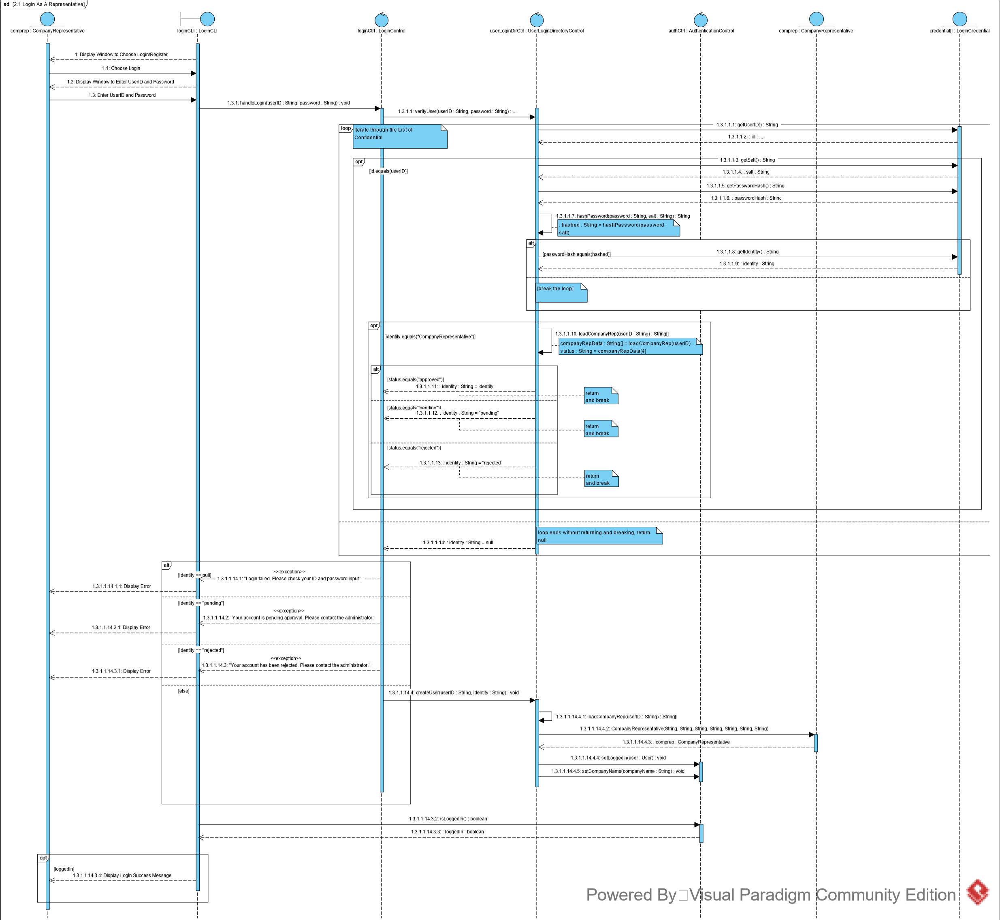
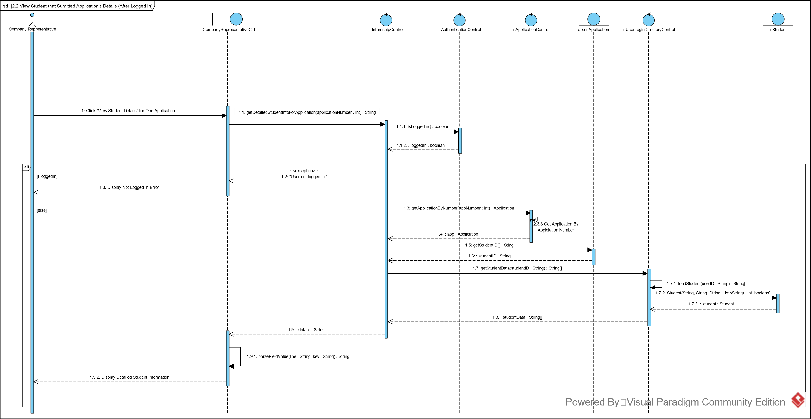
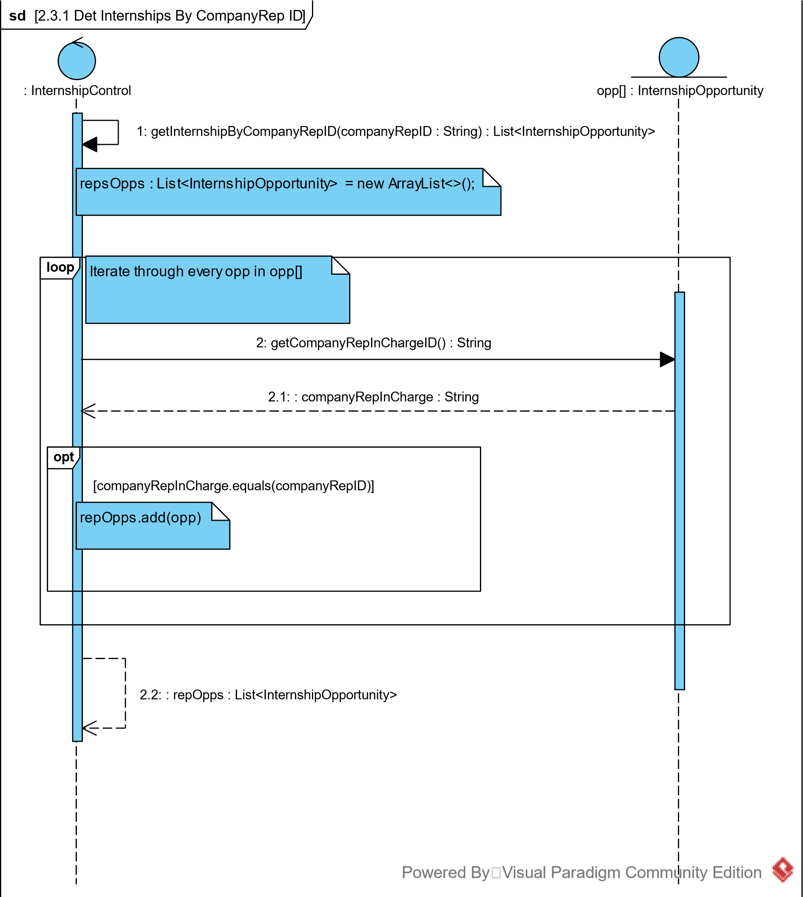
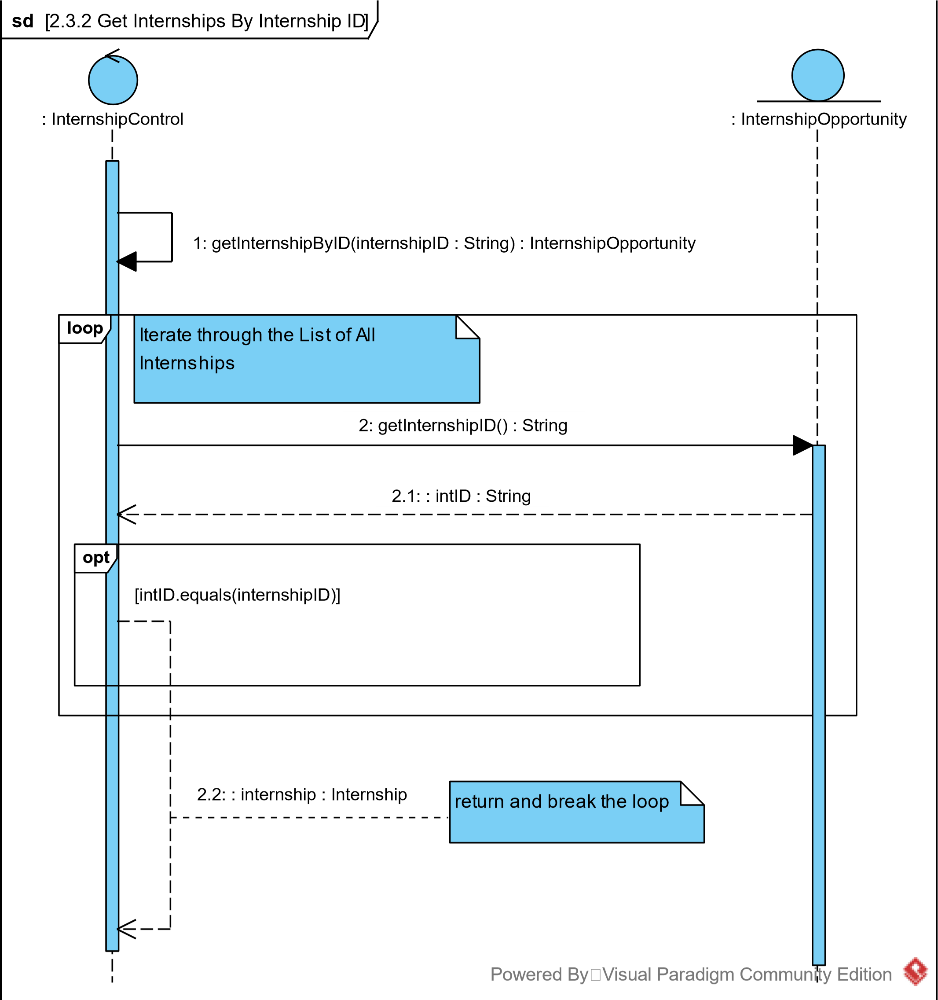
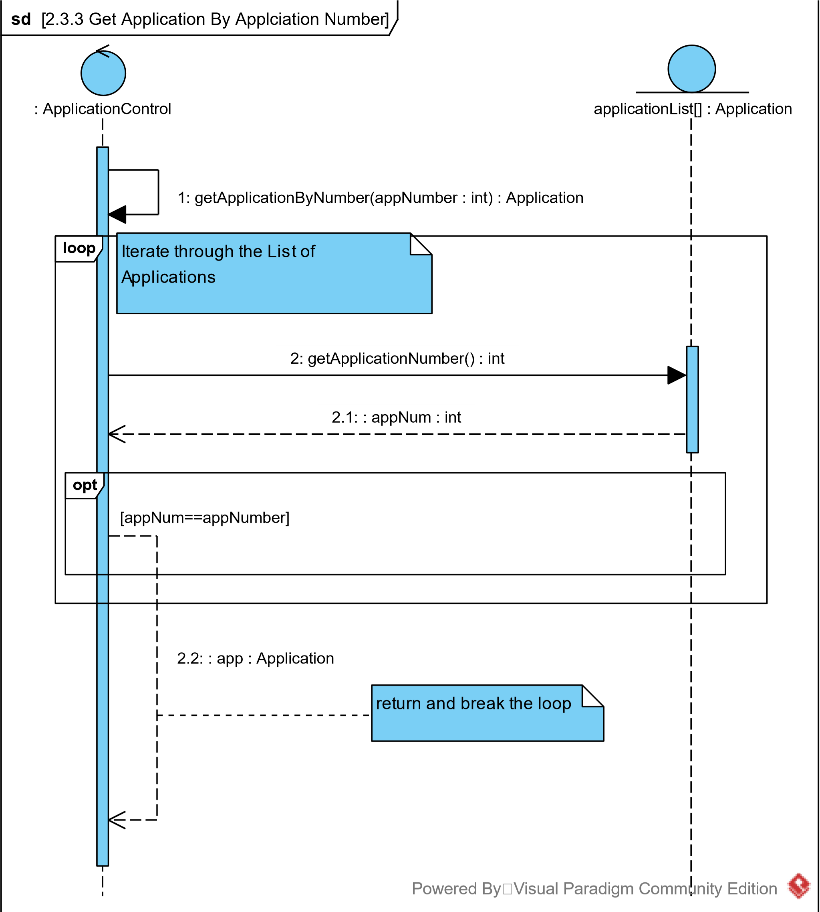

# Sequence Diagram

- **Overview**: This diagram shows the actions of an CompanyRepresentative logs in, and approves/rejects applications.
- **Contributor**: Allen, Hong Xun

----

|Sequence diagram|
|--------|
|[2 Comprep Approve/Reject](sequence_diagrams/2_CompanyRep%20_Approve_Reject_Application.png)|
|[2.1 Comprep Login](sequence_diagrams/2.1_CompanyRep_Login.png)|
|[2.2 Comprep View Student Details](sequence_diagrams/2.2_View_Student_Details.png)|
|[2.3.1 Get Internship By Comprep ID](sequence_diagrams/2.3.1_Get_Internship_By_ComprepID.png)|
|[2.3.2 Get Internship By Internship ID](sequence_diagrams/2.3.2_Get_Internship_By_Internship_ID.png)|
|[2.3.3 Get Application By Application Number](sequence_diagrams/2.3.3_Get_Application_By_Number.png)|

|Preview|
|---|
||
||
||
||
||
||
