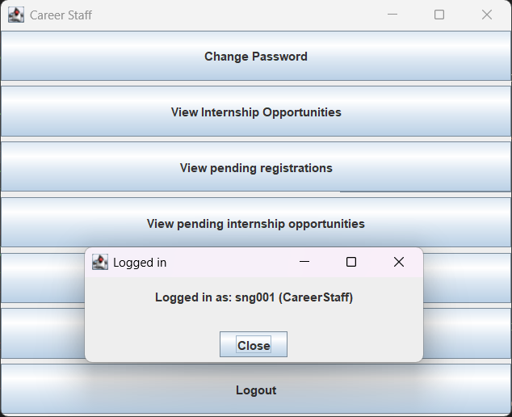
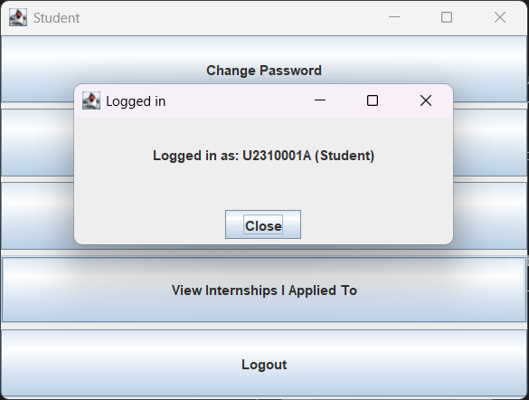
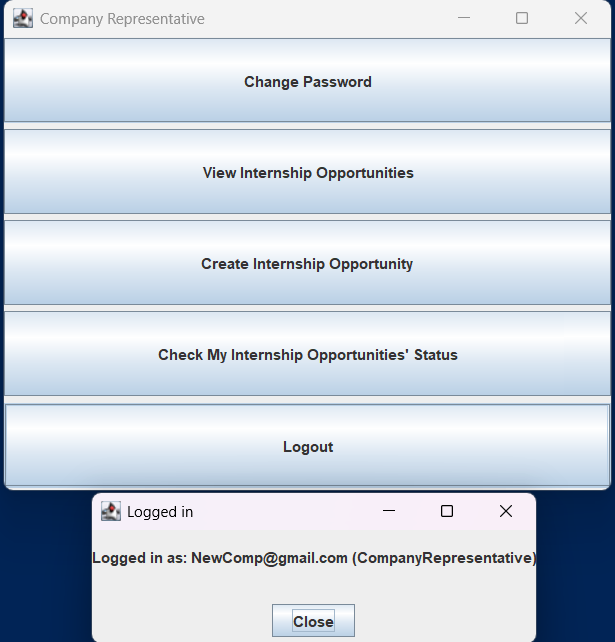

# Test Cases - Appendix A

## Test Case Summary

| Index | Test Case | Expected Behavior | Failure Indicator | Pass (Y/N) |
|-------|-----------|-------------------|-------------------|------------|
| 1 | Valid User Login | User should be able to access their dashboard based on their roles | User cannot log in or receive incorrect error messages | Y |
| 2 | Invalid ID | User receives a notification about incorrect ID | User is allowed to log in with an invalid ID or fail to provide meaningful error message | |
| 3 | Incorrect Password | System should deny access and alert the user to incorrect password | User logs in successfully with a wrong password or fail to provide meaningful error message | |
| 4 | Password Change Functionality | System updates password, prompt re-login and allows login with new credentials | System does not update the password or denies access with the new password | |
| 5 | Company Representative Account Creation | A new Company Representative should only be able to log in to their account after it has been approved by a Career Center Staff | Company Representative staff can log in without any authorization | |
| 6 | Internship Opportunity Visibility Based on User Profile and Toggle | Internship opportunities are visible to students based on their year of study, major, internship level eligibility, and the visibility setting | Students see internship opportunities not relevant to their profile (wrong major, wrong level for their year) or when visibility is off | |
| 7 | Internship Application Eligibility | Students can only apply for internship opportunities relevant to their profile (correct major preference, appropriate level for their year of study) and when visibility is on | Students can apply for internship opportunities not relevant to their profile (wrong major preference, Basic-level students applying for Intermediate/Advanced opportunities) or when visibility is off | |
| 8 | Viewing Application Status after Visibility Toggle Off | Students continue to have access to their application details regardless of internship opportunities' visibility | Application details become inaccessible once visibility is off | |
| 9 | - | - | - | |
| 10 | Single Internship Placement Acceptance per Student | System allows accepting one internship placement and automatically withdraws all other applications once a placement is accepted | Student can accept more than one internship placement, or other applications remain active after accepting | |

---

## Detailed Test Results

### Test Case 1: Valid User Login
- **Test Case:** Valid User Login
- **Expected Behavior:** User should be able to access their dashboard based on their roles
- **Actual Result:** Successfully logged in to Staff/Student/CompanyRep's respective Interface upon enter the correct username and password.
- **Failure Indicator:** User cannot log in or receive incorrect error messages
- **Pass:** Yes
- **Screenshots:** 

| Career Staff | Student | Company Rep |
| ---------- | ----------- | -------------- | 
|  |  ||
|  |
---

### Test Case 2: Invalid ID
- **Test Case:** Invalid ID
- **Expected Behavior:** User receives a notification about incorrect ID
- **Actual Result:** 
- **Failure Indicator:** User is allowed to log in with an invalid ID or fail to provide meaningful error message
- **Pass:**
- **Screenshots:** 
 

---

### Test Case 3: Incorrect Password
- **Test Case:** Incorrect Password
- **Expected Behavior:** System should deny access and alert the user to incorrect password
- **Actual Result:** 
- **Failure Indicator:** User logs in successfully with a wrong password or fail to provide meaningful error message
- **Pass:** 
- **Screenshots:** 

---

### Test Case 4: Password Change Functionality
- **Test Case:** Password Change Functionality
- **Expected Behavior:** System updates password, prompt re-login and allows login with new credentials
- **Actual Result:** 
- **Failure Indicator:** System does not update the password or denies access with the new password
- **Pass:** 
- **Screenshots:** 

---

### Test Case 5: Company Representative Account Creation
- **Test Case:** Company Representative Account Creation
- **Expected Behavior:** A new Company Representative should only be able to log in to their account after it has been approved by a Career Center Staff
- **Actual Result:** 
- **Failure Indicator:** Company Representative staff can log in without any authorization
- **Pass:** 
- **Screenshots:** 

---

### Test Case 6: Internship Opportunity Visibility Based on User Profile and Toggle
- **Test Case:** Internship Opportunity Visibility Based on User Profile and Toggle
- **Expected Behavior:** Internship opportunities are visible to students based on their year of study, major, internship level eligibility, and the visibility setting
- **Actual Result:** 
- **Failure Indicator:** Students see internship opportunities not relevant to their profile (wrong major, wrong level for their year) or when visibility is off
- **Pass:** 
- **Screenshots:** 

---

### Test Case 7: Internship Application Eligibility
- **Test Case:** Internship Application Eligibility
- **Expected Behavior:** Students can only apply for internship opportunities relevant to their profile (correct major preference, appropriate level for their year of study) and when visibility is on
- **Actual Result:** 
- **Failure Indicator:** Students can apply for internship opportunities not relevant to their profile (wrong major preference, Basic-level students applying for Intermediate/Advanced opportunities) or when visibility is off
- **Pass:** 
- **Screenshots:** 

---

### Test Case 8: Viewing Application Status after Visibility Toggle Off
- **Test Case:** Viewing Application Status after Visibility Toggle Off
- **Expected Behavior:** Students continue to have access to their application details regardless of internship opportunities' visibility
- **Actual Result:** 
- **Failure Indicator:** Application details become inaccessible once visibility is off
- **Pass:** 
- **Screenshots:** 

---

### Test Case 9: -
- **Test Case:** -
- **Expected Behavior:** -
- **Actual Result:** 
- **Failure Indicator:** -
- **Pass:** 
- **Screenshots:** 

---

### Test Case 10: Single Internship Placement Acceptance per Student
- **Test Case:** Single Internship Placement Acceptance per Student
- **Expected Behavior:** System allows accepting one internship placement and automatically withdraws all other applications once a placement is accepted
- **Actual Result:** 
- **Failure Indicator:** Student can accept more than one internship placement, or other applications remain active after accepting
- **Pass:** 
- **Screenshots:** 

---

## Notes
- Add any additional observations or comments here
